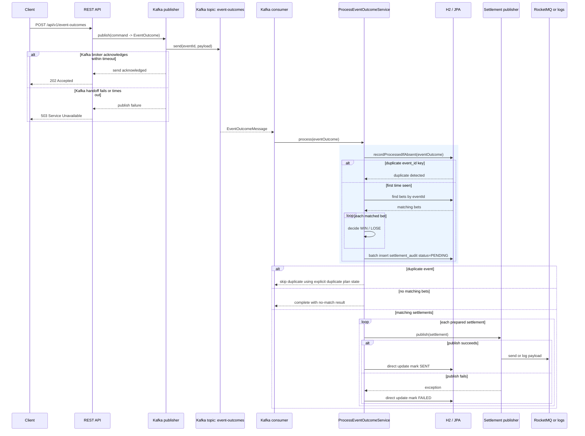
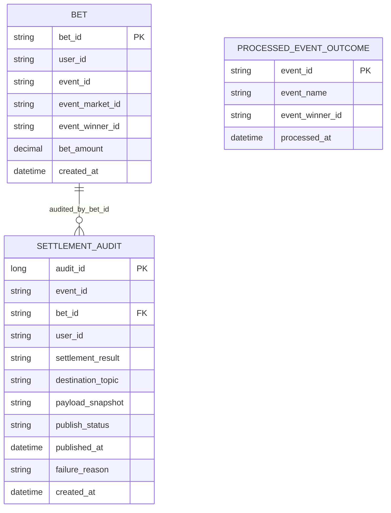

# Architecture

This service is the trigger-and-dispatch part of a betting settlement workflow.
It accepts a sports event outcome, publishes that outcome to Kafka, consumes it back through an internal processing flow, matches bets by `eventId`, and dispatches settlement messages to RocketMQ or a supported logging fallback.

## System context

```mermaid
flowchart LR
    Client[Client / Reviewer]
    Rest[REST API\nSpring MVC controllers]
    KafkaProducer[Kafka event outcome publisher]
    Kafka[(Kafka topic\nevent-outcomes)]
    KafkaConsumer[Kafka event outcome consumer]
    App[Application services\npublish, process, query, reset]
    H2[(H2 in-memory DB\nFlyway schema + seed data)]
    RocketPublisher[RocketMQ settlement publisher]
    LoggingPublisher[Logging settlement publisher]
    Rocket[(RocketMQ topic\nbet-settlements)]
    Actuator[Actuator + Micrometer]

    Client --> Rest
    Rest --> App
    App --> KafkaProducer --> Kafka --> KafkaConsumer --> App
    App <--> H2
    App --> RocketPublisher --> Rocket
    App --> LoggingPublisher
    App --> Actuator
    Client -. inspect .-> Actuator
```

## End-to-end runtime flow

1. `POST /api/v1/event-outcomes` accepts a validated event outcome.
2. `PublishEventOutcomeService` delegates to `KafkaEventOutcomePublisher`, which waits briefly for Kafka broker acknowledgement before the API returns `202` and only then records the accepted-event metric.
3. Kafka receives the payload on the configured event outcome topic, keyed by `eventId`.
4. `KafkaEventOutcomeConsumer` reads the message and maps it back into the domain model.
5. `ProcessEventOutcomeService` opens a transactional preparation step using `TransactionOperations` and delegates the preparation work to `SettlementDispatchPreparationService`.
6. In that preparation step `SettlementDispatchPreparationService`:
   - it uses one insert-first processed-outcome persistence path and treats unique-key insert conflicts as duplicates
   - loads matching bets by `eventId`
   - decides each settlement as `WIN` or `LOSE` via the injected domain service `BetSettlementDecider`
   - resolves the destination topic and fresh payload snapshots through the narrower `BetSettlementPayloadPort`
   - writes `PENDING` settlement audit rows in a batch with payload snapshots
7. After the preparation step completes, `ProcessEventOutcomeService` publishes each prepared settlement outside the transaction through the narrower `BetSettlementDispatchPort` and delegates failure-reason formatting to the dedicated application support component `SettlementFailureReasonFormatter`, while the transactional result is carried in the dispatch-focused `application.model.dispatch.PreparedDispatchPlan` type with explicit `DUPLICATE`, `NO_MATCH`, and `DISPATCH_REQUIRED` outcomes instead of a magic destination sentinel. The shared settlement payload area is split intentionally: `BetSettlementPayloadSnapshotFactory` owns destination-topic plus fresh snapshot creation for the transactional stage, and `BetSettlementPayloadCodec` owns shared message mapping plus stored-snapshot restoration for publisher replay support.
8. Each settlement audit row is updated to `SENT` or `FAILED` with direct repository update operations depending on the publication attempt.
9. In local/test-oriented profiles, `RetrySettlementDispatchService` can replay `PENDING` or `FAILED` settlement audit rows from the stored payload snapshot through the narrower `BetSettlementReplayPort`, using the stored destination topic and stored payload snapshot unchanged.
10. Micrometer counters and summaries track accepted events, processed results, prepared settlements, dispatched settlements, and demo resets.

The current test suite freezes that behavior more explicitly as well: publish acceptance and failure, Kafka-driven settlement dispatch, duplicate/no-match handling, `PreparedDispatchPlan` contracts, and manual retry replay semantics are covered separately so later refactors can preserve the already-correct runtime flow.

At the HTTP boundary, each controller owns a focused mapper collaborator: event-outcome requests/responses, bet-query responses, and demo-helper responses are mapped separately to keep REST concerns local to the endpoint that uses them.

## Service flow diagram



## Current transactional model

The implementation intentionally separates the workflow into two stages:

### 1. Transactional preparation

Handled by `ProcessEventOutcomeService` through `TransactionOperations`, with the actual preparation work delegated to `SettlementDispatchPreparationService`.

What happens transactionally:

- processed-outcome dedup write via a single atomic insert path
- bet lookup
- settlement decision preparation
- destination-topic and fresh payload-snapshot creation via `BetSettlementPayloadPort`
- batched insertion of `PENDING` audit rows

### 2. Out-of-transaction dispatch

Handled after the transactional preparation step completes.

What happens after the transaction:

- message publication to RocketMQ or logging fallback
- failure-reason formatting through `SettlementFailureReasonFormatter`
- audit updates to `SENT` or `FAILED` through direct repository update statements
- dispatch metrics

What can happen later in local/test helper flows:

- `RetrySettlementDispatchService` can query retryable `PENDING` / `FAILED` audit rows
- the stored payload snapshot is replayed through `BetSettlementReplayPort`
- each replay attempt updates the audit row back to `SENT` or refreshes `FAILED`

This keeps remote publication out of the database transaction, but it is not a full outbox pattern.

## Deduplication and audit model

### Deduplication

The service uses `processed_event_outcome` as a simple event-level dedup store keyed by `event_id`.

Current behavior:

- first successfully prepared outcome for an `eventId` is recorded as processed
- later outcomes with the same `eventId` are treated as duplicates and skipped
- the hot path attempts one insert into `processed_event_outcome` and treats unique-key conflicts as duplicates
- dedup is based on the event identifier, not on deep payload comparison

### Settlement audit

`settlement_audit` records settlement publication intent and outcome.

Each audit row store:

- event and bet identity
- user identity
- settlement result snapshot
- destination topic
- serialized payload snapshot stored as bounded `VARCHAR(4096)` rather than a LOB because the current settlement JSON snapshots are intentionally compact
- publish status (`PENDING`, `SENT`, `FAILED`)
- publication timestamp and optional failure reason
- creation timestamp

This creates an operational trace even when outbound dispatch fails.

The base schema also adds lightweight integrity checks for positive bet amounts plus the allowed settlement-result and publish-status values, keeping the H2 contract small while catching obvious drift below the application layer.

The current codebase also uses that audit trail for a modest manual recovery path: local/test operators can trigger replay of `PENDING` and `FAILED` rows without reconstructing settlements from scratch.

For a detailed review of how this persistence model behaves under higher database load and multi-instance scaling pressure, see [`DB_SCALING_REVIEW.md`](DB_SCALING_REVIEW.md).

## Persistence hot-path notes

- `findByEventIdOrderByBetIdAsc` is backed by a composite `bet(event_id, bet_id)` index in the base schema so the main filter-and-order query matches the database layout more closely.
- `BetQueryPersistenceAdapter` marks its event and full-bet reads as read-only so query intent stays explicit at the transaction boundary.
- `findAllByPublishStatusInOrderByCreatedAtAscBetIdAsc` is backed by a composite `settlement_audit(publish_status, created_at, bet_id)` index so manual replay scans do not rely on a low-value single-column audit index.
- `settlement_audit.payload_snapshot` matches the entity contract as a bounded `VARCHAR(4096)`, and schema tests prove both the accepted maximum size and rejection of oversized payload snapshots.
- `settlement_audit` status changes no longer load an entity before updating; the adapter checks the repository update count and still fails loudly if the audit row is missing.
- The write adapters share a single UTC `Clock` bean so processed-outcome inserts and audit timestamps use one explicit time source instead of static hidden clocks.
- The current model keeps preparation writes transactional and outbound publication outside that transaction, improving the hot path without turning the design into an outbox implementation.

## Database design



## Runtime profiles and publisher behavior

| Profile          | Intended usage                      | Kafka                                      | Settlement publisher                           | Notes                                   |
|------------------|-------------------------------------|--------------------------------------------|------------------------------------------------|-----------------------------------------|
| `local-fallback` | Quick local review with app on host | Real Kafka on `localhost:29092` by default | Logging fallback                               | Swagger/OpenAPI enabled; exposes H2 TCP |
| `local-docker`   | Full Docker-backed demo stack       | Kafka in Compose                           | Real RocketMQ publisher                        | Also exposes H2 TCP when enabled        |
| `test`           | Automated tests                     | Testcontainers-backed Kafka where relevant | Usually mocked or profile-specific test wiring | Used by integration tests               |
| default          | Base configuration only             | Configurable                               | Logging mode unless overridden                 | Springdoc disabled                      |

Publisher-mode rule:

- `logging` is the intentional fallback/default mode
- `rocketmq` means RocketMQ transport is required and startup fails if no `RocketMQTemplate` is available
- silent downgrade from explicit RocketMQ mode to logging mode is no longer allowed

### IntelliJ run-configuration mapping

The checked-in `.run/` files map directly to the architecture modes above:

- `BetSettler [local-fallback]` is the preferred host-run review path because it keeps Kafka real while using the supported logging settlement publisher.
- `BetSettler [local-docker]` targets the full Docker-backed queue stack and exercises the real RocketMQ adapter.
- `BetSettler [test]` mirrors the test profile family for local inspection of test-oriented behavior.
- `Docker Compose Queues` and `Docker Compose All` provide the infrastructure side of those flows, and `Produce Test Stats` refreshes the committed verification snapshot after a successful build.

## Key architectural boundaries

### Domain boundary

`BetSettlementDecider`, `ValidationSupport`, and the domain records stay independent of Spring, JPA, Kafka, and RocketMQ.

The application receives `BetSettlementDecider` through infrastructure configuration, so the domain remains framework-free while still being injectable.

### Application boundary

Ports isolate the use cases from transport and persistence details.
`ProcessEventOutcomeService` owns high-level orchestration, while `SettlementDispatchPreparationService` owns the transactional preparation concern and depends only on the narrower `BetSettlementPayloadPort` for destination and payload-snapshot needs.
Supporting application concerns are separated more explicitly: application-owned result and audit records live under `application.model.dispatch` and `application.model.audit`, while bounded failure formatting lives under `application.support`.
The application layer knows what must happen, but not how Kafka, JPA, or RocketMQ are implemented.

### Infrastructure boundary

Controllers, message adapters, repositories, config, and observability classes implement the required runtime concerns without pushing those dependencies into the domain. Shared settlement transport DTOs, mapping, snapshot support, replay codec support, and the logging fallback publisher sit in the neutral `infrastructure.messaging.settlement` namespace, while the real RocketMQ publisher remains under `infrastructure.messaging.rocketmq.publisher`. `MessagingConfiguration` makes the logging publisher the only intentional fallback, exposes the snapshot-focused `BetSettlementPayloadPort` for the transactional stage, and requires RocketMQ transport wiring whenever `publisher-mode=rocketmq` is selected. `PersistenceConfiguration` contributes the shared UTC clock used by the write adapters so persistence time ownership stays explicit and testable.

The automated test tree follows the same ownership lines more closely: bootstrap checks live under `bootstrap` with smoke-oriented suite names, shared Kafka Testcontainers support lives under `testsupport`, shared REST integration support lives under `testsupport.rest` but is split into a generic HTTP helper plus smaller opt-in publisher and settlement-audit fixtures, Kafka integration flows live under `infrastructure.messaging.kafka.integration`, REST integration coverage is split into `controller`, `actuator`, `openapi`, and `profile` suites, and persistence integration coverage is split into `adapter` and `schema` packages rather than concentrated in umbrella classes.

## Known limitations

These are deliberate and match the current codebase state.

- Deduplication is basic and keyed only by `eventId`.
- The database writing and outbound publication are not atomically coordinated.
- Failed settlement dispatches are audited and can be replayed manually in local/test profiles, but there is still no automatic replay worker.
- The H2 database is in-memory and resets on application restart.
- The logging publisher is a supported fallback mode, not a bug or a stub.

## Related documents

- [`README.md`](README.md) - practical run and use guide
- [`STRUCTURE.md`](STRUCTURE.md) - package ownership and module map
- [`DB_SCALING_REVIEW.md`](DB_SCALING_REVIEW.md) - detailed database-load, throughput, and horizontal-scaling review
- [`QUALITY.md`](QUALITY.md) - Maven gates, CI workflows, and current stats
